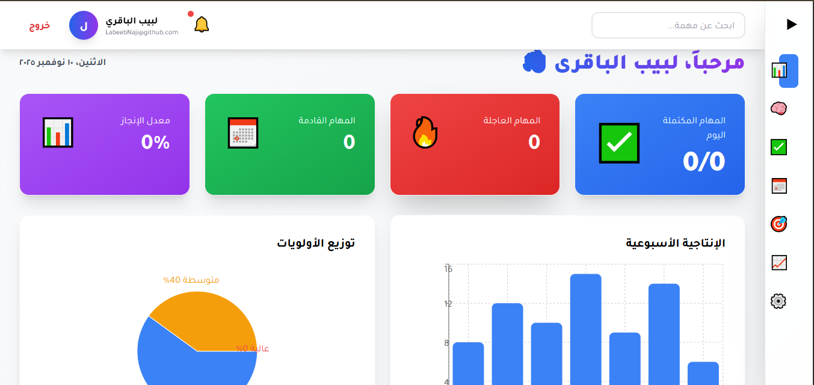
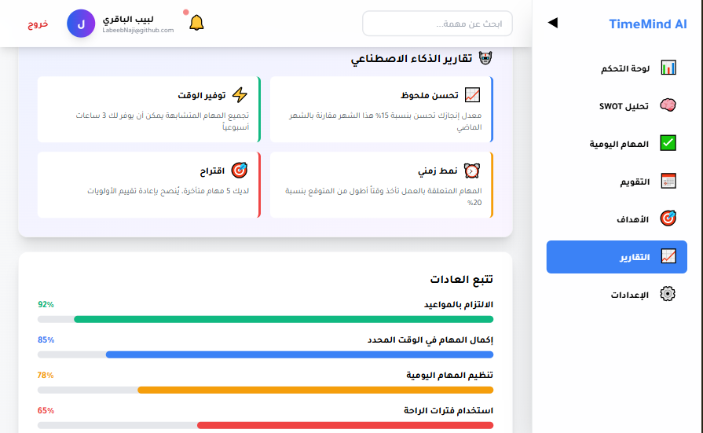
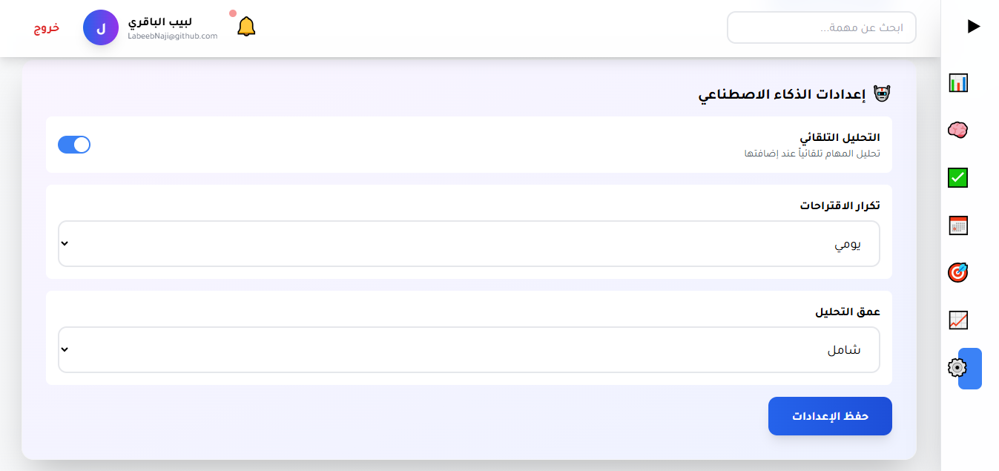
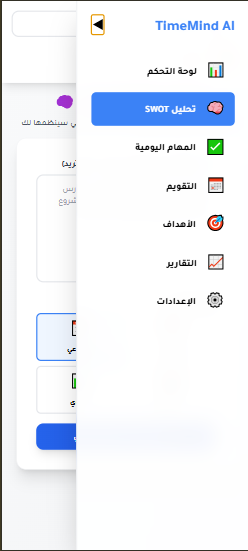

# 🧠 TimeMind AI - Smart Time Management System

<div align="center">

**Advanced Time and Task Management System Fully Powered by Artificial Intelligence**

[](https://reactjs.org/)
[](https://vitejs.dev/)
[](https://laravel.com/)
[](https://tailwindcss.com/)
[](https://groq.com/)

[Features](#-features) • [Technologies](#-technologies-used) • [Installation](#-installation) • [Usage](#-usage) • [Screenshots](#-screenshots) • [Contact](#-contact)

</div>

---

## 📖 Overview

**TimeMind AI** is a comprehensive time and task management system that uses artificial intelligence to automatically analyze and organize your tasks. The system provides intelligent SWOT analysis, automatic scheduling, and detailed reports to boost your productivity.

### ✨ Why TimeMind AI?

- 🤖 **Advanced AI**: Intelligent task analysis and automatic organization
- 📊 **SWOT Analysis**: Analyze strengths, weaknesses, opportunities, and threats
- 📅 **Smart Scheduling**: Automatic suggestions for optimal time management
- 📈 **Detailed Reports**: Comprehensive charts and statistics
- 🎯 **Goal Management**: Track and achieve your goals effectively
- 🌐 **Arabic Interface**: Full support for Arabic language
- 📱 **Responsive Design**: Works on all devices

---

## 🎯 Features

### 1. 🧠 Intelligent SWOT Analysis

- Automatic task analysis using artificial intelligence
- Extract tasks from free text
- Automatic priority assignment
- Personalized schedule suggestions

### 2. ✅ Daily Task Management

- Easy task addition and editing
- Task categorization (work, study, personal, health)
- Priority levels (high, medium, low)
- Track completed and overdue tasks

### 3. 📊 Interactive Dashboard

- Real-time productivity statistics
- Weekly performance charts
- Priority distribution
- Smart AI suggestions

### 4. 📅 Smart Calendar

- Display tasks in an interactive calendar
- Deadline alerts
- Drag and drop tasks

### 5. 🎯 Goal Management

- Set short and long-term goals
- Track progress
- Link tasks to goals

### 6. 📈 Reports and Analytics

- Weekly and monthly reports
- Productivity analysis
- Completion rates
- Improvement recommendations

---

## 🛠 Technologies Used

### Frontend

- **React 18.2.0** - JavaScript library for building user interfaces
- **Vite 5.0.8** - Fast and modern build tool
- **React Router DOM 6.20.0** - Navigation between pages
- **Axios 1.6.2** - HTTP client for API communication
- **Tailwind CSS 3.3.6** - CSS framework for styling
- **Recharts 2.10.3** - Charting library
- **React Calendar 4.7.0** - Calendar components
- **Date-fns 3.0.0** - Date manipulation library

### Backend

- **Laravel 11.x** - Powerful PHP framework
- **PHP 8.2+** - Programming language
- **SQLite** - Lightweight database
- **Laravel Sanctum** - Authentication system
- **Groq AI API** - Advanced artificial intelligence

### Artificial Intelligence

- **Groq API** - High-performance AI platform
- **Advanced Language Models** - For Arabic text analysis
- **Natural Language Processing** - For understanding and extracting tasks

---

## 📦 Installation

### Prerequisites

- Node.js 18+ and npm
- PHP 8.2+
- Composer
- Git

### 1. Clone the Project

```bash
git clone https://github.com/labeebnaji/Timemind_App[React-Laravel].git
cd timemind-ai-frontend
```

### 2. Install Frontend

```bash
cd frontend

# Install packages
npm install

# Copy environment file
cp .env.example .env

# Start development server
npm run dev
```

Server will run on: `http://localhost:5173`

### 3. Get Backend

> ⚠️ **Note**: Backend is not available in this repository. To get the complete code with Backend, please contact me.

**To get the complete Backend:**
📧 Email: **<labeebderhem@gmail.com>**

Backend includes:

- ✅ Complete Laravel API
- ✅ Authentication and registration system
- ✅ Database and models
- ✅ AI integration
- ✅ Controllers and Services
- ✅ Configuration files

---

## 🚀 Usage

### 1. Registration and Login

- Create a new account
- Login using your email and password

### 2. Smart SWOT Analysis

1. Go to "SWOT Analysis" page
2. Write your tasks in any format (example: "I have a math exam on Thursday and a meeting with the manager")
3. Choose the time period (daily, weekly, monthly, yearly)
4. Click "Analyze with AI"
5. Get comprehensive analysis with suggested schedule

### 3. Daily Task Management

- Add new tasks easily
- Set priority and category
- Set deadline
- Track your progress

### 4. View Reports

- Review your statistics in the dashboard
- Track your weekly productivity
- Get smart suggestions

---

## 📸 Screenshots

### Dashboard



### Smart SWOT Analysis


### Reports and Analytics



### Settings



### Responsive Design



---

## 🏗 Project Structure

```
timemind-ai-frontend/
├── frontend/
│   ├── src/
│   │   ├── components/        # Reusable components
│   │   │   └── Layout.jsx    # Main page layout
│   │   ├── pages/            # Application pages
│   │   │   ├── Login.jsx
│   │   │   ├── Register.jsx
│   │   │   ├── Dashboard.jsx
│   │   │   ├── SwotAnalysis.jsx
│   │   │   ├── DailyTasks.jsx
│   │   │   ├── Calendar.jsx
│   │   │   ├── Goals.jsx
│   │   │   ├── Analytics.jsx
│   │   │   └── Settings.jsx
│   │   ├── services/         # API services
│   │   │   └── api.js
│   │   ├── App.jsx          # Main component
│   │   ├── index.css        # Global styles
│   │   └── main.jsx         # Entry point
│   ├── public/              # Public files
│   ├── package.json
│   ├── vite.config.js
│   └── tailwind.config.js
├── screenshots/             # Screenshots
└── README.md
```

---

## 🔧 Configuration

### Environment Variables

Create a `.env` file in the frontend directory:

```env
VITE_API_URL=http://localhost:8000/api
```

---

## 🎨 Customization

### Colors

You can customize colors in `tailwind.config.js`:

```javascript
theme: {
  extend: {
    colors: {
      primary: '#3B82F6',
      secondary: '#10B981',
      danger: '#EF4444',
      warning: '#F59E0B',
    }
  }
}
```

---

## 🤝 Contributing

Contributions are welcome! If you'd like to contribute:

1. Fork the project
2. Create a feature branch (`git checkout -b feature/AmazingFeature`)
3. Commit your changes (`git commit -m 'Add some AmazingFeature'`)
4. Push to the branch (`git push origin feature/AmazingFeature`)
5. Open a Pull Request

---

## 📝 License

This project is licensed under the MIT License - see the [LICENSE](LICENSE) file for details.

---

## 👨‍💻 Developer

**Labeeb Naji**

- 📧 Email: <labeebderhem@gmail.com>
- 💼 GitHub: [@labeebnaji](https://github.com/labeebnaji)

---

## 📞 Contact

To get the complete Backend or for any inquiries:

📧 **Email**: <labeebderhem@gmail.com>

**What you'll get:**

- ✅ Complete Backend code (Laravel)
- ✅ Database and models
- ✅ AI integration
- ✅ API Documentation
- ✅ Technical support

---

## 🙏 Acknowledgments

- Thanks to [React](https://reactjs.org/) for the amazing library
- Thanks to [Vite](https://vitejs.dev/) for the blazing fast build tool
- Thanks to [Laravel](https://laravel.com/) for the powerful framework
- Thanks to [Tailwind CSS](https://tailwindcss.com/) for the easy styling
- Thanks to [Groq](https://groq.com/) for the advanced AI

---

## 📊 Stats


---

<div align="center">

**Made with ❤️ by Labeeb Naji**

⭐ If you like this project, don't forget to give it a star!

</div>
