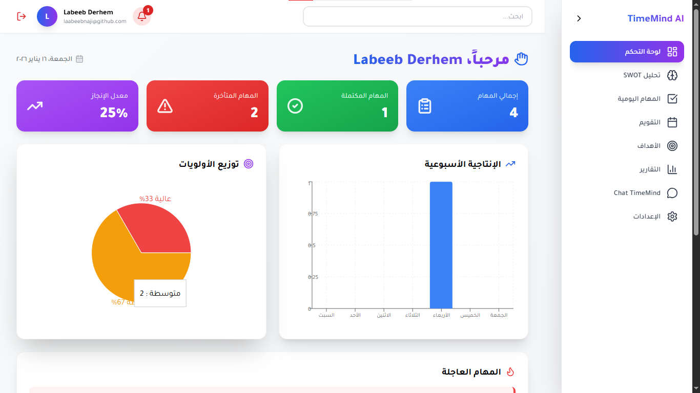
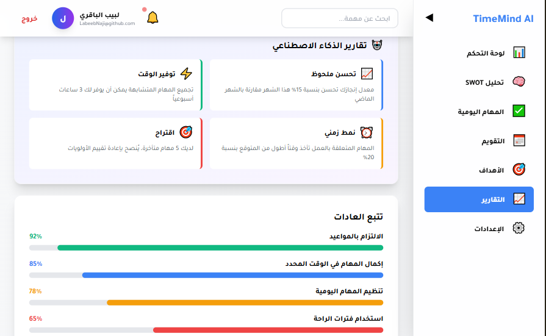
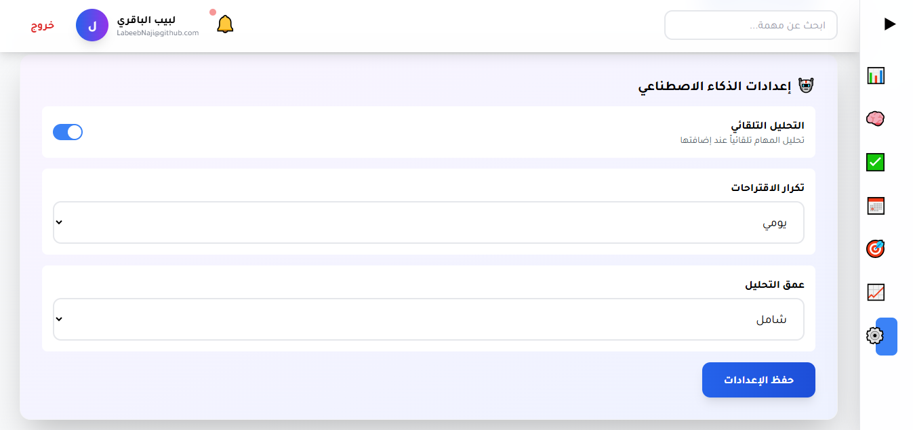
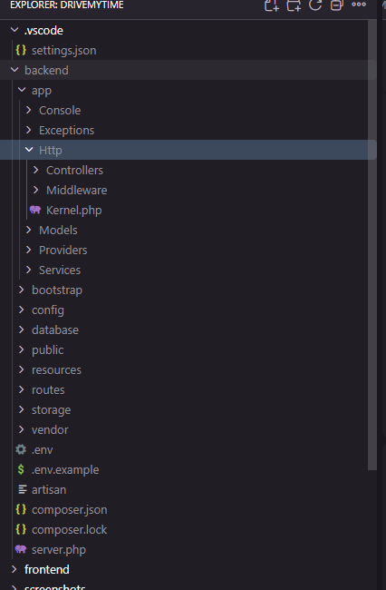
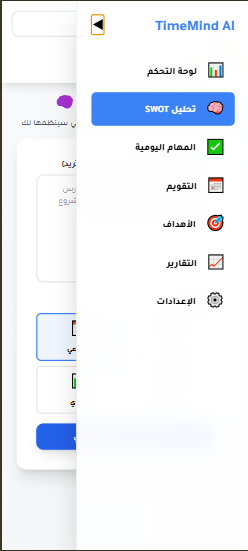

# 🧠 TimeMind AI - Smart Time Management System

<div align="center">

**Advanced Time and Task Management System Fully Powered by Artificial Intelligence**

[](https://reactjs.org/)
[](https://vitejs.dev/)
[](https://laravel.com/)
[](https://tailwindcss.com/)
[](https://groq.com/)

[Features](#-features) • [Technologies](#-technologies-used) • [Installation](#-installation) • [Usage](#-usage) • [Screenshots](#-screenshots) • [Contact](#-contact)

</div>

---

## 📖 Overview

**TimeMind AI** is a comprehensive time and task management system that uses artificial intelligence to automatically analyze and organize your tasks. The system provides intelligent SWOT analysis, automatic scheduling, and detailed reports to boost your productivity.

---

## 🛠 Technologies Used

### Frontend

- **React 18.2.0** - JavaScript library for building user interfaces
- **Vite 5.0.8** - Fast and modern build tool
- **React Router DOM 6.20.0** - Navigation between pages
- **Axios 1.6.2** - HTTP client for API communication
- **Tailwind CSS 3.3.6** - CSS framework for styling
- **Recharts 2.10.3** - Charting library
- **React Calendar 4.7.0** - Calendar components
- **Date-fns 3.0.0** - Date manipulation library

### Backend

- **Laravel 11.x** - Powerful PHP framework
- **PHP 8.2+** - Programming language
- **SQLite** - Lightweight database
- **Laravel Sanctum** - Authentication system
- **Groq AI API** - Advanced artificial intelligence

### Artificial Intelligence
- **Groq API** - High-performance AI platform
- **Advanced Language Models** - For Arabic text analysis
- **Natural Language Processing** - For understanding and extracting tasks

---

## 📦 Installation

### Prerequisites

- Node.js 18+ and npm
- PHP 8.2+
- Composer
- Git

### 1. Clone the Project

```bash
git clone https://github.com/labeebnaji/Timemind_App-React-Laravel-AI-.git
cd frontend
```

### 2. Install Frontend

```bash
cd frontend

# Install packages
npm install

# Copy environment file
cp .env.example .env

# Start development server
npm run dev
```

Server will run on: `http://localhost:5173`

### 3. Install Backend

```bash
cd backend

# Install PHP packages
composer install

# Copy environment file
cp .env.example .env

# Generate application key
php artisan key:generate

# Run database migrations
php artisan migrate

# Start development server
php artisan serve
```

API will run on: `http://localhost:8000`


---

## 📸 Screenshots

### Dashboard



### Smart SWOT Analysis


### Reports and Analytics



### Settings



### Backend (Laravel API)



### Responsive Design




---

## 🔧 Configuration

### Environment Variables

Create a `.env` file in the frontend directory:

```env
VITE_API_URL=http://localhost:8000/api
```

---

## 🎨 Customization

### Colors

You can customize colors in `tailwind.config.js`:

```javascript
theme: {
  extend: {
    colors: {
      primary: '#3B82F6',
      secondary: '#10B981',
      danger: '#EF4444',
      warning: '#F59E0B',
    }
  }
}
```

---

## 👨‍💻 Developer

**Labeeb Naji**

- 📧 Email: <labeebderhem@gmail.com>
- 💼 GitHub: [@labeebnaji](https://github.com/labeebnaji)

---

## 📞 Contact


**Made with ❤️ by Labeeb Naji**

⭐ If you like this project, don't forget to give it a star!

</div>
